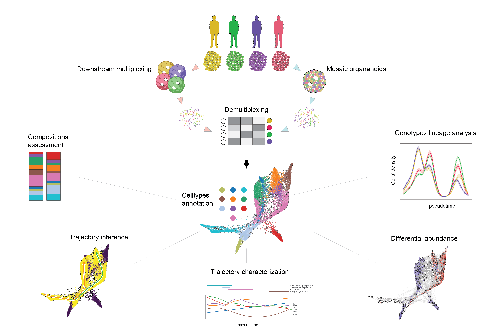

# Organoid Multiplexing

**Organoid Multiplexing**

This repo contains the code used to analyze Single cell data of organoid Multiplexing manuscript

Docker image for main analysis can be retrieved via docker pull testalab/downstream:organoidMultiplexing-1.1.0

After alignment of each sample, Cellranger's output: features, barcodes and count matrix should be placed in data/Sample*/filtered_feature_bc_matrix respective directories

Additional resources should be placed in data/resources. 

genes.gtf (gex-GRCh38-2020-A gtf), KOLF2C1 wgs data from hipsci, single cell eqtl data from jerber et al. (https://doi.org/10.1038/s41588-021-00801-6)

In addition pipeline for consensus deconvolution can be found at ... and its docker image

Finally VarAdata were generated using the SCanSNP version ... specifying --mode matrixgen

An html version of the notebooks is accessible [here](https://GiuseppeTestaLab.github.io/organoidMultiplexing_release/).

## 01_HVGs_joining.ipynb

Links: [jupyter notebook](00_HVGs/01_HVGs_joining.ipynb) and [html file](https://GiuseppeTestaLab.github.io/organoidMultiplexing_release/00_HVGs/01_HVGs_joining.html).

## 01.1_Dataset_Preprocessing_DownD50.ipynb

Links: [jupyter notebook](01_PreProcess/01.1_Dataset_Preprocessing_DownD50.ipynb) and [html file](https://GiuseppeTestaLab.github.io/organoidMultiplexing_release/01_PreProcess/01.1_Dataset_Preprocessing_DownD50.html).

## 01.2_Dataset_Preprocessing_UpD50.ipynb

Links: [jupyter notebook](01_PreProcess/01.2_Dataset_Preprocessing_UpD50.ipynb) and [html file](https://GiuseppeTestaLab.github.io/organoidMultiplexing_release/01_PreProcess/01.2_Dataset_Preprocessing_UpD50.html).

## 01.3_Dataset_Preprocessing_DownD100.ipynb

Links: [jupyter notebook](01_PreProcess/01.3_Dataset_Preprocessing_DownD100.ipynb) and [html file](https://GiuseppeTestaLab.github.io/organoidMultiplexing_release/01_PreProcess/01.3_Dataset_Preprocessing_DownD100.html).

## 01.4_Dataset_Preprocessing_UpD100_1.ipynb

Links: [jupyter notebook](01_PreProcess/01.4_Dataset_Preprocessing_UpD100_1.ipynb) and [html file](https://GiuseppeTestaLab.github.io/organoidMultiplexing_release/01_PreProcess/01.4_Dataset_Preprocessing_UpD100_1.html).

## 01.5_Dataset_Preprocessing_UpD100_2.ipynb

Links: [jupyter notebook](01_PreProcess/01.5_Dataset_Preprocessing_UpD100_2.ipynb) and [html file](https://GiuseppeTestaLab.github.io/organoidMultiplexing_release/01_PreProcess/01.5_Dataset_Preprocessing_UpD100_2.html).

## 01.6_Dataset_Preprocessing_DownD250.ipynb

Links: [jupyter notebook](01_PreProcess/01.6_Dataset_Preprocessing_DownD250.ipynb) and [html file](https://GiuseppeTestaLab.github.io/organoidMultiplexing_release/01_PreProcess/01.6_Dataset_Preprocessing_DownD250.html).

## 01.7_Dataset_Preprocessing_UpD300.ipynb

Links: [jupyter notebook](01_PreProcess/01.7_Dataset_Preprocessing_UpD300.ipynb) and [html file](https://GiuseppeTestaLab.github.io/organoidMultiplexing_release/01_PreProcess/01.7_Dataset_Preprocessing_UpD300.html).

## 02_Dataset_Merging.ipynb

Links: [jupyter notebook](01_PreProcess/02_Dataset_Merging.ipynb) and [html file](https://GiuseppeTestaLab.github.io/organoidMultiplexing_release/01_PreProcess/02_Dataset_Merging.html).

## 03_Dataset_Not_Integrated_JointScale.ipynb

Links: [jupyter notebook](01_PreProcess/03_Dataset_Not_Integrated_JointScale.ipynb) and [html file](https://GiuseppeTestaLab.github.io/organoidMultiplexing_release/01_PreProcess/03_Dataset_Not_Integrated_JointScale.html).

## 04_Dataset_Integration_Harmony.ipynb

Links: [jupyter notebook](01_PreProcess/04_Dataset_Integration_Harmony.ipynb) and [html file](https://GiuseppeTestaLab.github.io/organoidMultiplexing_release/01_PreProcess/04_Dataset_Integration_Harmony.html).

## 05_Clusters_Annotation_All.ipynb

Links: [jupyter notebook](01_PreProcess/05_Clusters_Annotation_All.ipynb) and [html file](https://GiuseppeTestaLab.github.io/organoidMultiplexing_release/01_PreProcess/05_Clusters_Annotation_All.html).

## 05.2_inGestion.ipynb

Links: [jupyter notebook](02_Exploration/05.2_inGestion.ipynb) and [html file](https://GiuseppeTestaLab.github.io/organoidMultiplexing_release/02_Exploration/05.2_inGestion.html).

## 06_Exploration.ipynb

Links: [jupyter notebook](02_Exploration/06_Exploration.ipynb) and [html file](https://GiuseppeTestaLab.github.io/organoidMultiplexing_release/02_Exploration/06_Exploration.html).

## 07_Paga.ipynb

Links: [jupyter notebook](02_Exploration/07_Paga.ipynb) and [html file](https://GiuseppeTestaLab.github.io/organoidMultiplexing_release/02_Exploration/07_Paga.html).

## 08_DA.ipynb

Links: [jupyter notebook](02_Exploration/08_DA.ipynb) and [html file](https://GiuseppeTestaLab.github.io/organoidMultiplexing_release/02_Exploration/08_DA.html).

## 08.0_Astrocytes_HVGs.ipynb

Links: [jupyter notebook](03_Trajectories/08.0_Astrocytes_HVGs.ipynb) and [html file](https://GiuseppeTestaLab.github.io/organoidMultiplexing_release/03_Trajectories/08.0_Astrocytes_HVGs.html).

## 08.1_Astrocytes_Lineage.ipynb

Links: [jupyter notebook](03_Trajectories/08.1_Astrocytes_Lineage.ipynb) and [html file](https://GiuseppeTestaLab.github.io/organoidMultiplexing_release/03_Trajectories/08.1_Astrocytes_Lineage.html).

## 09.0_Cajal_HVGs.ipynb

Links: [jupyter notebook](03_Trajectories/09.0_Cajal_HVGs.ipynb) and [html file](https://GiuseppeTestaLab.github.io/organoidMultiplexing_release/03_Trajectories/09.0_Cajal_HVGs.html).

## 09.1_Cajal_Lineage.ipynb

Links: [jupyter notebook](03_Trajectories/09.1_Cajal_Lineage.ipynb) and [html file](https://GiuseppeTestaLab.github.io/organoidMultiplexing_release/03_Trajectories/09.1_Cajal_Lineage.html).

## 10.0_Exc_HVGs.ipynb

Links: [jupyter notebook](03_Trajectories/10.0_Exc_HVGs.ipynb) and [html file](https://GiuseppeTestaLab.github.io/organoidMultiplexing_release/03_Trajectories/10.0_Exc_HVGs.html).

## 10.1_Exc_Lineage.ipynb

Links: [jupyter notebook](03_Trajectories/10.1_Exc_Lineage.ipynb) and [html file](https://GiuseppeTestaLab.github.io/organoidMultiplexing_release/03_Trajectories/10.1_Exc_Lineage.html).

## 11.0_Interneurons_HVGs.ipynb

Links: [jupyter notebook](03_Trajectories/11.0_Interneurons_HVGs.ipynb) and [html file](https://GiuseppeTestaLab.github.io/organoidMultiplexing_release/03_Trajectories/11.0_Interneurons_HVGs.html).

## 11.1_Interneurons_Lineage.ipynb

Links: [jupyter notebook](03_Trajectories/11.1_Interneurons_Lineage.ipynb) and [html file](https://GiuseppeTestaLab.github.io/organoidMultiplexing_release/03_Trajectories/11.1_Interneurons_Lineage.html).

## 12.0_MigratingNeurons_HVGs.ipynb

Links: [jupyter notebook](03_Trajectories/12.0_MigratingNeurons_HVGs.ipynb) and [html file](https://GiuseppeTestaLab.github.io/organoidMultiplexing_release/03_Trajectories/12.0_MigratingNeurons_HVGs.html).

## 12.1_MigratingNeurons_Lineage.ipynb

Links: [jupyter notebook](03_Trajectories/12.1_MigratingNeurons_Lineage.ipynb) and [html file](https://GiuseppeTestaLab.github.io/organoidMultiplexing_release/03_Trajectories/12.1_MigratingNeurons_Lineage.html).

## 13.0_varAnndata_prep_new.ipynb

Links: [jupyter notebook](04_ASE/13.0_varAnndata_prep_new.ipynb) and [html file](https://GiuseppeTestaLab.github.io/organoidMultiplexing_release/04_ASE/13.0_varAnndata_prep_new.html).

## 13.1_SantyCheck.ipynb

Links: [jupyter notebook](04_ASE/13.1_SantyCheck.ipynb) and [html file](https://GiuseppeTestaLab.github.io/organoidMultiplexing_release/04_ASE/13.1_SantyCheck.html).

## 13.2_ASE_explo.ipynb

Links: [jupyter notebook](04_ASE/13.2_ASE_explo.ipynb) and [html file](https://GiuseppeTestaLab.github.io/organoidMultiplexing_release/04_ASE/13.2_ASE_explo.html).

## 15_Lines_Balance.ipynb

Links: [jupyter notebook](05_LinesBalance/15_Lines_Balance.ipynb) and [html file](https://GiuseppeTestaLab.github.io/organoidMultiplexing_release/05_LinesBalance/15_Lines_Balance.html).

## 16_Tools_comparison.ipynb

Links: [jupyter notebook](05_LinesBalance/16_Tools_comparison.ipynb) and [html file](https://GiuseppeTestaLab.github.io/organoidMultiplexing_release/05_LinesBalance/16_Tools_comparison.html).

Repository will be complete upon publication

---
*Note: this README file has been generated automatically.*  
*Please do not modify it directly but instead work on [this config file](resources/config.yaml).*

